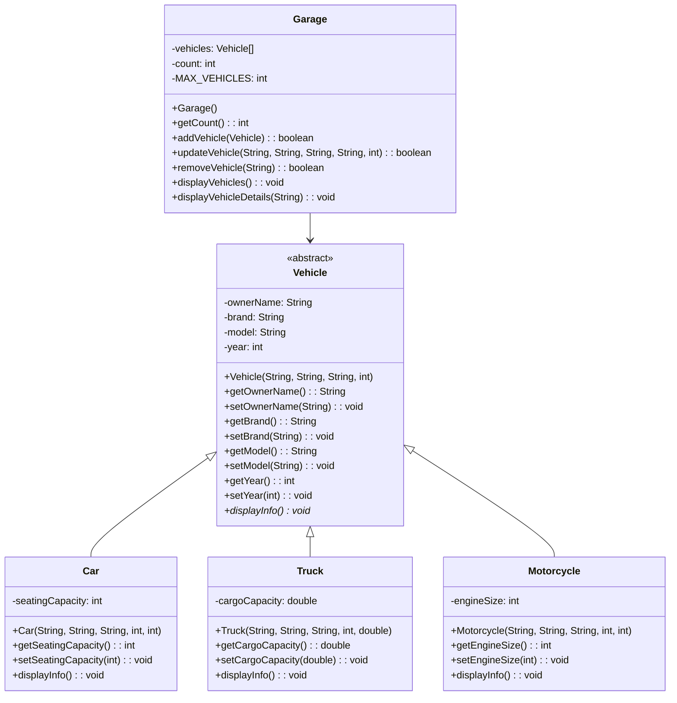

# UML Class Diagram - Vehicle Management System

## Class Relationships Diagram



## Detailed Inheritance Relationships

### Inheritance Hierarchy

```
                    ┌─────────────────┐
                    │    Vehicle      │
                    │   (Abstract)    │
                    └────────┬────────┘
                             │
                ┌────────────┼────────────┐
                │            │            │
                ▼            ▼            ▼
            ┌─────────┐  ┌─────────┐  ┌───────────┐
            │   Car   │  │  Truck  │  │Motorcycle│
            └─────────┘  └─────────┘  └───────────┘
```

### Aggregation Relationship

```
┌────────┐     contains      ┌────────┐
│ Garage │  ◇─────────────── │Vehicle │
│        │   1          0..100│        │
│        │     (one-to-many)  │        │
└────────┘                    └────────┘
```

## OOP Principles Visualization

### 1. Abstraction
- `Vehicle` is an abstract class with abstract method `displayInfo()`
- Subclasses must provide concrete implementation
- Hides implementation complexity from users

### 2. Inheritance
- All three vehicle types (`Car`, `Truck`, `Motorcycle`) inherit from `Vehicle`
- Each extends the base class with specific attributes:
  - `Car` → seatingCapacity
  - `Truck` → cargoCapacity
  - `Motorcycle` → engineSize
- Reuses common attributes and methods from `Vehicle`

### 3. Encapsulation
- All attributes are marked as `private` (-)
- Public getters and setters (+) control access
- Internal implementation is hidden from external users

### 4. Polymorphism
- Method `displayInfo()` is overridden in all subclasses
- Runtime polymorphism: correct method is called based on actual object type
- Garage can work with any Vehicle subclass through the Vehicle reference type

## Method Signatures

### Vehicle Class Methods
```
+Vehicle(ownerName: String, brand: String, model: String, year: int)
+getOwnerName(): String
+setOwnerName(ownerName: String): void
+getBrand(): String
+setBrand(brand: String): void
+getModel(): String
+setModel(model: String): void
+getYear(): int
+setYear(year: int): void
+displayInfo(): void (abstract)
```

### Car Class Methods (additions to Vehicle)
```
+Car(ownerName: String, brand: String, model: String, year: int, seatingCapacity: int)
+getSeatingCapacity(): int
+setSeatingCapacity(seatingCapacity: int): void
+displayInfo(): void (override)
```

### Truck Class Methods (additions to Vehicle)
```
+Truck(ownerName: String, brand: String, model: String, year: int, cargoCapacity: double)
+getCargoCapacity(): double
+setCargoCapacity(cargoCapacity: double): void
+displayInfo(): void (override)
```

### Motorcycle Class Methods (additions to Vehicle)
```
+Motorcycle(ownerName: String, brand: String, model: String, year: int, engineSize: int)
+getEngineSize(): int
+setEngineSize(engineSize: int): void
+displayInfo(): void (override)
```

### Garage Class Methods
```
+Garage()
+getCount(): int
+addVehicle(vehicle: Vehicle): boolean
+updateVehicle(currentOwner: String, newOwner: String, brand: String, model: String, year: int): boolean
+removeVehicle(ownerName: String): boolean
+displayVehicles(): void
+displayVehicleDetails(ownerName: String): void
```

## Multiplicity Constraints

| Relationship | Multiplicity | Description |
|-------------|--------------|-------------|
| Garage to Vehicle | 1 : 0..100 | One garage holds 0 to 100 vehicles |
| Vehicle to Garage | Many : 1 | Many vehicles can be managed by one garage |
| Car inherits from Vehicle | 1 : 1 | One Car maps to one Vehicle type |
| Truck inherits from Vehicle | 1 : 1 | One Truck maps to one Vehicle type |
| Motorcycle inherits from Vehicle | 1 : 1 | One Motorcycle maps to one Vehicle type |

## Access Modifiers Summary

| Modifier | Used In | Purpose |
|----------|---------|---------|
| `public` | All classes, all methods | Allows external access |
| `private` | All attributes | Restricts access to encapsulate data |
| `protected` | Not used | Would allow subclass access |
| `abstract` | Vehicle class, displayInfo() | Defines contract for subclasses |
| `static` | MAX_VEHICLES in Garage | Class-level constant |

## Design Notes

1. **No Repository Pattern**: Uses simple array-based storage instead of database
2. **Case-Insensitive Search**: String comparisons use `.equalsIgnoreCase()` for flexibility
3. **Bounded Collection**: Garage has maximum capacity of 100 vehicles
4. **Fail-Safe Operations**: All modification methods return boolean for status indication
5. **Polymorphic Display**: Each subclass provides own implementation of displayInfo()
6. **Extensible Design**: New vehicle types can be added by extending Vehicle class
